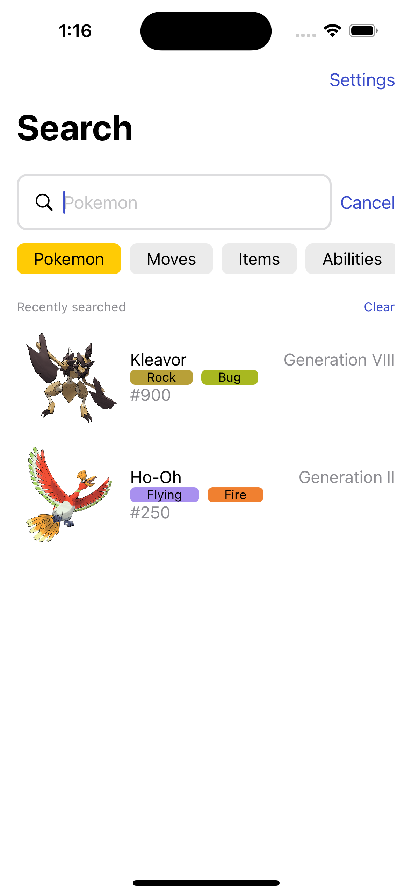

# PokedexRemake
A remake of my [Pokedex](https://github.com/tinotusa/Pokedex) app. This is used for testing out the new PokeAPI wrapper package.

Pokeapi wrapper being used: [SwiftPokeAPI](https://github.com/tinotusa/SwiftPokeAPI).

## TODO
- [x] Search view
- [x] Pokemon view
- [x] Moves view
- [x] Items view
- [x] Locations view
- [x] Generations view
- [x] Dark mode